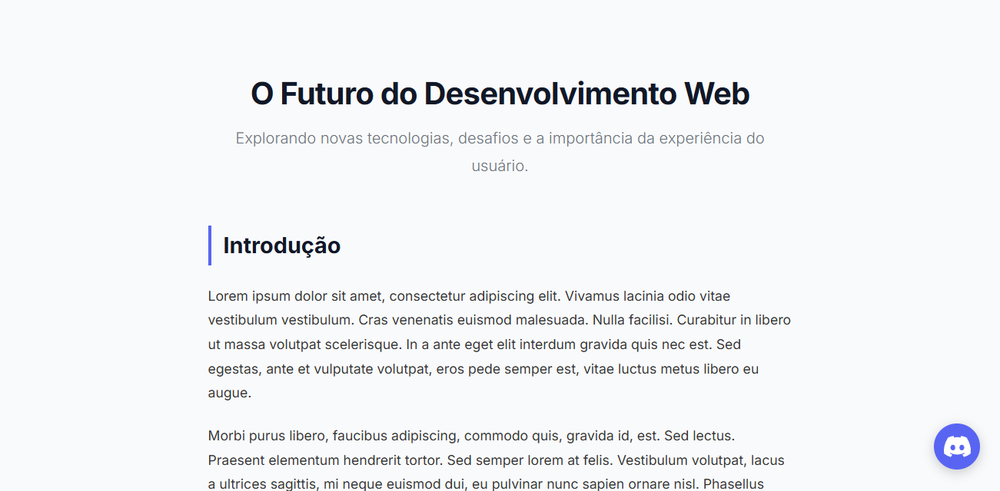

# 📊 Barra de Progresso de Leitura

Uma página web interativa que exibe uma barra de progresso de leitura fixa no topo, atualizando em tempo real conforme o usuário rola a página. O projeto demonstra o cálculo de scroll progress através de JavaScript puro, com um design moderno e responsivo.

---

## 🎯 Sobre o Projeto

Este projeto é um desafio do programa **GoDevs**, onde foi desenvolvida uma solução prática e elegante para visualizar o progresso de leitura de uma página. A barra se atualiza suavemente conforme o usuário faz scroll, oferecendo uma experiência visual fluida e moderna.

### ✨ Características

- ✅ Barra de progresso fixa no topo da página
- ✅ Atualização em tempo real do scroll progress
- ✅ Design responsivo e moderno
- ✅ Animação suave com `requestAnimationFrame`
- ✅ Sem dependências externas (JavaScript puro)
- ✅ Estrutura de pastas organizada
- ✅ Botão flutuante de contato (Discord)

---

## 🛠️ Tecnologias Utilizadas


---

## 📋 Requisitos Obrigatórios Atendidos

1. ✅ **Barra fixa no topo** - `position: fixed; top: 0; left: 0` com z-index alto
2. ✅ **Width dinâmico** - Atualizado em tempo real conforme scroll do usuário
3. ✅ **Cálculo de scroll progress**:
   - `scrollTop = window.scrollY`
   - `docHeight = document.documentElement.scrollHeight - document.documentElement.clientHeight`
   - `progress = (scrollTop / docHeight) * 100`
   - `width da barra = progress + "%"`
4. ✅ **Eventos de atualização** - Scroll, DOMContentLoaded e resize
5. ✅ **Proteção contra divisão por zero** - Se docHeight ≤ 0, progress = 100%
6. ✅ **Conteúdo abundante** - Múltiplas seções para teste de scroll
7. ✅ **Otimização com requestAnimationFrame** - Mantém fluidez de 60fps
8. ✅ **CSS de qualidade** - Visual moderno, limpo e responsivo

---

## 📁 Estrutura do Projeto

```
barra-de-progresso-de-leitura/
├── index.html
├── css/
│   └── style.css
├── js/
│   └── script.js
├── logos/
│   └── discord.svg
├── assets/
│   ├── README.md
│   └── screenshots/
│       ├── README.md
│       ├── screenshot-inicial.png
│       └── screenshot-com-progresso.png
└── README.md
```

---

## 📸 Capturas de Tela

### Página Inicial


### Com Barra de Progresso Preenchida


---

## 🚀 Como Usar

1. **Clone o repositório:**
   ```bash
   git clone https://github.com/Guielihan/barra-de-progresso-de-leitura.git
   cd barra-de-progresso-de-leitura
   ```

2. **Abra o arquivo no navegador:**
   - Localize o arquivo `index.html`
   - Abra-o em seu navegador favorito

3. **Teste a funcionalidade:**
   - Role a página para ver a barra de progresso preencher
   - Observe a animação suave e fluida
   - Clique no botão Discord flutuante para entrar em contato

---

## 💻 Como Funciona

### Cálculo do Scroll Progress

O arquivo `js/script.js` implementa o seguinte algoritmo:

```javascript
// obtém a posição atual do scroll
const scrollTop = window.scrollY || document.documentElement.scrollTop;

// calcula a altura total rolável
const docHeight = document.documentElement.scrollHeight - document.documentElement.clientHeight;

// calcula a porcentagem
const scrolled = (scrollTop / docHeight) * 100;

// aplica à barra
progressBar.style.width = scrolled + "%";
```

### Otimizações

- **requestAnimationFrame**: Sincroniza atualizações com a taxa de quadros do navegador
- **Throttling**: Evita recálculos excessivos durante o scroll
- **Proteção contra erros**: Garante funcionamento mesmo com conteúdo pequeno

---

## 🎨 Detalhes de Design

- **Barra de Progresso**: Gradiente azul-roxo com sombra suave (glow)
- **Transição suave**: `transition: width 0.1s linear`
- **Responsivo**: Adapta-se perfeitamente a todos os tamanhos de tela
- **Tipografia**: Fonte Inter (Google Fonts) para leitura confortável
- **Botão Discord**: Flutuante no canto inferior direito com hover animado

---

## 👨‍💻 Desenvolvedor

**Guilherme Queiroz (Guielihan)**

<div style="display: flex; gap: 10px; flex-wrap: wrap;">
  <a href="https://discord.com/users/1297971679737413632">
    
  </a>
  <a href="https://www.instagram.com/devguielihan/">
    
  </a>
  <a href="mailto:devguielihan@gmail.com">
    
  </a>
</div>

---

## 🎓 Agradecimentos e Referências

<div style="display: flex; gap: 10px; flex-wrap: wrap;">
  <a href="https://github.com/in100tiva">
    
  </a>
  <a href="https://godevs.in100tiva.com/">
    
  </a>
</div>

---

<p align="center">
  Feito com 💙 por Guielihan
</p>
